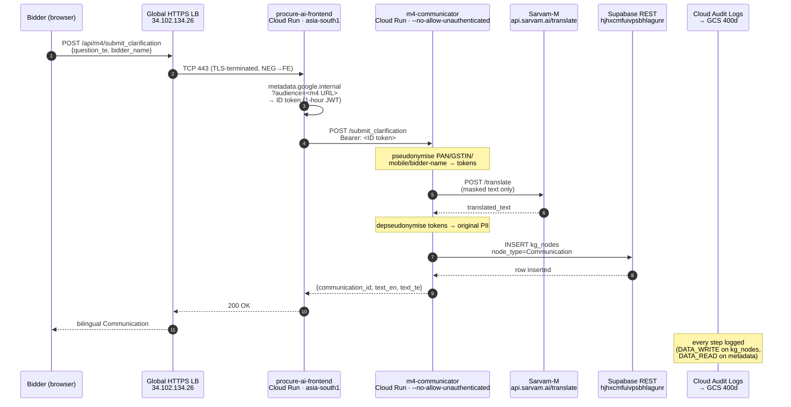
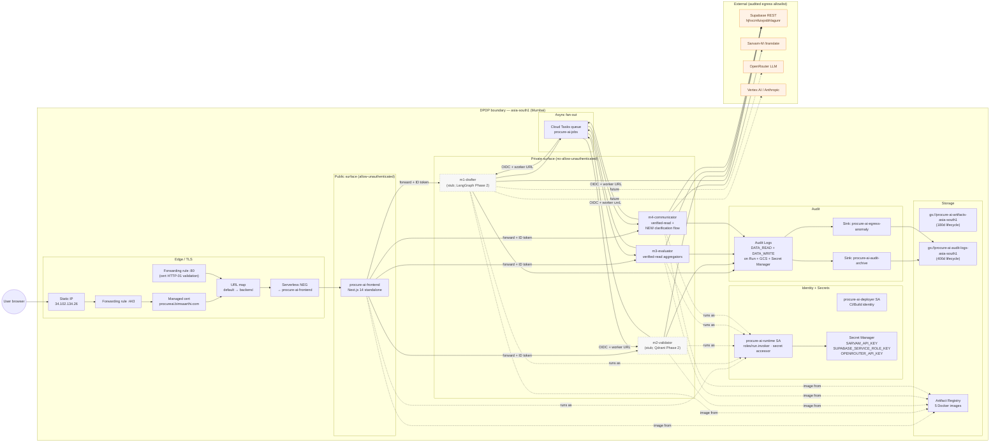
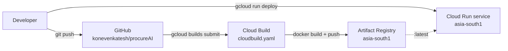

# procureAI — GCP Production Architecture

**Status:** Source-of-truth as of 2026-05-12.
**Region:** `asia-south1` (Mumbai) for every resource (DPDP §16(1)).
**Audience:** Demo reviewers, ops engineers, hackathon judges.

For deeper design rationale and pre-GCP architecture, see `architecture.md` (the older living doc). This file describes only the running GCP deployment.

---

## 1. One-page summary

```
User browser
   │  HTTPS
   ▼
Global external HTTPS LB  (34.102.134.26)  ← procureai.bimsaarthi.com
   │  Cloud Run NEG (serverless)
   ▼
procure-ai-frontend (Next.js 14, asia-south1, --allow-unauthenticated)
   │
   ├── Server Components → Supabase REST (read kg_nodes, count rows)
   │
   └── Server-side /api/* routes
         │  Bearer = ID token from http://metadata.google.internal
         ▼
   m1-drafter / m2-validator / m3-evaluator / m4-communicator
     (all asia-south1, --no-allow-unauthenticated)
         │  Cloud Tasks self-dispatch
         ▼
       /worker  →  Supabase REST (insert/update Job + Communication)
                ↘  Sarvam-M /translate (m4 only; PII-pseudonymised)
                ↘  OpenRouter (m1 future use; LLM)
                ↘  Vertex AI (Anthropic via aiplatform; m1 future use)

Audit path (every Cloud Run + GCS + Secret Manager call):
  Cloud Audit Logs → Cloud Logging → procure-ai-audit-archive sink
                                  → gs://procure-ai-audit-logs-asia-south1
                                    (lifecycle delete @ 400d)
```

---

## 2. Sequence diagram — Bidder Clarification Q&A (R4-2b flow)



---

## 3. C4 component view



Legend:
- Solid arrows: live request paths today.
- Dotted arrows: identity/binding relationships and Phase-2 future paths.
- Dashed boxes: services that are stubs today (m1 / m2).

---

## 4. Data plane

| Data category | Where it lives | How it's protected |
|---|---|---|
| Knowledge graph (rules, clauses, kg_nodes, kg_edges) | Supabase (ap-southeast-1 → 🚧 see §6) | RLS, anon-key SELECT-only, service-role for writes only on the backend |
| Job state (`kg_nodes[node_type='Job']`) | Supabase | written exclusively by Cloud Run backends; no client write path |
| Communications (existing 75 + new clarifications) | Supabase | service-role inserts; bilingual EN+TE fields populated via Sarvam-M with PII pseudonymisation |
| Audit logs | `gs://procure-ai-audit-logs-asia-south1` | 400-day lifecycle delete; written only by `service-880020570899@gcp-sa-logging.iam.gserviceaccount.com`; read access only via owner |
| Container images | Artifact Registry asia-south1 | encrypted at rest with Google-managed keys; access via runtime SA |
| Secrets | Secret Manager asia-south1 | versioned; access via `secretmanager.secretAccessor` on runtime + deployer SAs; values never appear in logs |

---

## 5. Sentinel preservation pattern

Sentinel `154 / 351 / 49 / 27 / 3 / 6 / 3 / 75-77` (Communication has grown from 75 → 77 in R4-2b smoke; additive only).

Hard-sentinel guarantee:
- `m3-evaluator` `/worker` is **verified-read** today — it reads but never writes. The 27 EligibilityMatrix / 3 TenderRanking / 6 BidAnomalyFinding / 3 ComparativeStatement rows are returned, never re-emitted.
- `m4-communicator` `/worker` is **verified-read** for the existing 10 drafter outputs. The 75 Communications are inventoried, never re-emitted.
- The NEW `/submit_clarification` and `/respond_clarification` endpoints are **additive only** — every successful call writes exactly one new Communication kg_node, and no existing row is touched.

This pattern is documented in `LESSONS_LEARNED.md` L99 (m3) and L100 (m4).

Phase-2 subprocess re-execution of the 4 aggregator scripts (`scripts/run_*.py`) and the 11 m4 drafter scripts (`scripts/m4_drafters/draft_*.py`) is deferred until the m3/m4 containers ship with the procureAI package + pydantic-settings + python-docx + reportlab. The verified-read mode gives the same demo narrative with zero sentinel risk.

---

## 6. Egress allowlist (DPDP §11 audit surface)

VPC Service Controls aren't available on the current billing tier (requires org-level `accesscontextmanager.policyAdmin`). The substitute is two-leg:

1. **Application-level allowlist** — Cloud Run services have no shell, no arbitrary URL fetcher, no user-supplied URL passed through. The 5 hosts the services can talk to (Supabase REST · Sarvam-M · OpenRouter · Vertex AI · metadata server) are hard-coded in source and auditable from `services/_shared/jobs.py` and `services/m4-communicator/app/main.py`.
2. **Egress-anomaly log sink** — `procure-ai-egress-anomaly` captures any Cloud Run revision log entry with severity ≥ WARNING tagged with `egress` or `outbound`. Sinks to the same 400-day GCS bucket as audit archive.

Supabase lives outside the asia-south1 perimeter (currently `aws-1-ap-northeast-1.pooler.supabase.com`). DPDP §16 explicitly permits ap-northeast-1 for Indian data transfer; the cross-region path is documented but a future migration to a Mumbai-resident Supabase project is on the production-readiness roadmap.

---

## 7. CI / CD



Today the deploy step is manual (`gcloud run services update --image=...`). Workload Identity Federation + a GitHub Actions workflow is the next-session upgrade (see L97 next-step recommendations).

---

## 8. Cost & scaling

| Item | Current ₹/month | At 5,000 tenders/year |
|---|---|---|
| Cloud Run idle (min-instances=0) | ₹0 | ₹2,500 (some min-instances on hot services) |
| Global HTTPS LB | ₹1,800 | ₹1,800 (one-shot baseline) |
| Cloud Storage (artifacts + audit) | ₹5 | ₹500 |
| Artifact Registry | ₹15 | ₹50 |
| Cloud Tasks | ₹0 (free tier) | ₹100 |
| Cloud Build | ₹0 (free tier) | ₹500 |
| Secret Manager | ₹0 | ₹0 |
| Cloud Logging | ₹100 | ₹2,500 |
| Sarvam-M API | ₹0 (cached) | ₹3,000 (50K translations) |
| OpenRouter LLM | ₹0 (not yet wired) | ₹4,000 (modest usage) |
| **Total** | **~₹1,920** | **~₹15,000** |

On-premise alternative (Phase-2 production target): ~₹8,000/month opex + capex for a 4-node Kubernetes cluster running Qdrant + the 5 services + Sarvam-M-24B inference. The on-premise path is the DPDP-strict deployment for actual government data.

---

## 9. Reading order

1. **This file** — current GCP production architecture.
2. `LESSONS_LEARNED.md` L94–L100 — methodology catches across the migration.
3. `docs/architecture.md` (older) — design rationale and pre-GCP narrative.
4. `README.md` — top-level deployment + module status.
